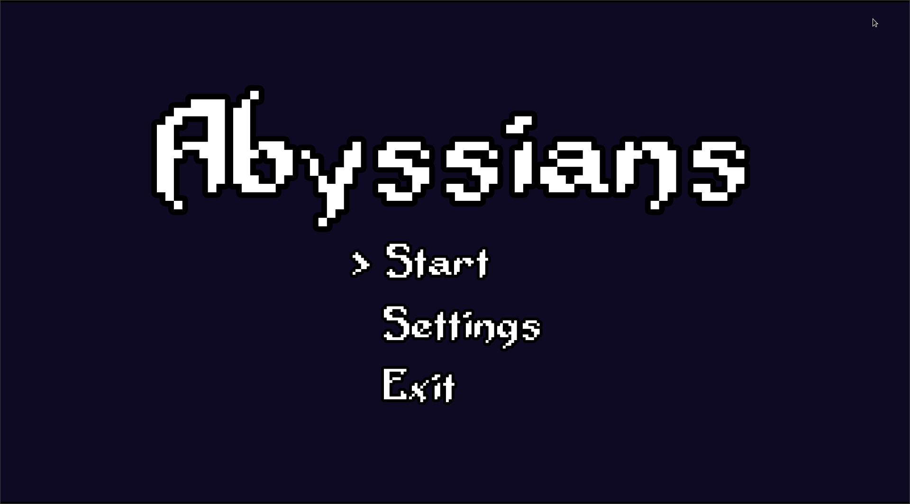
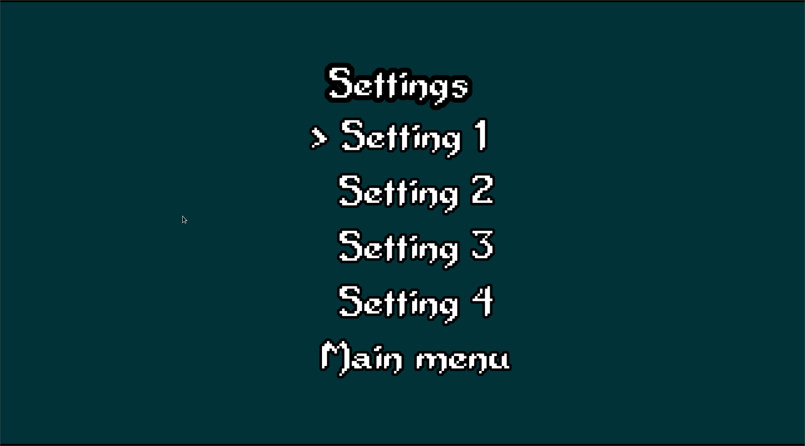
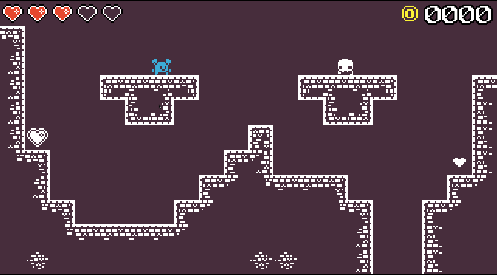
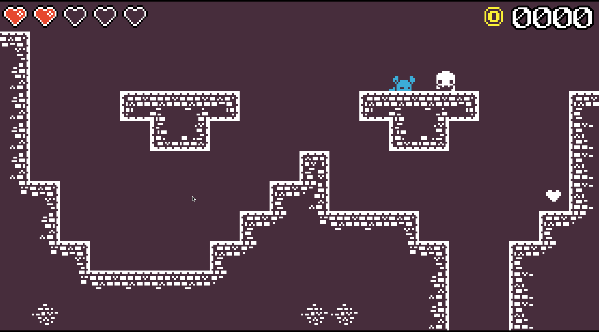
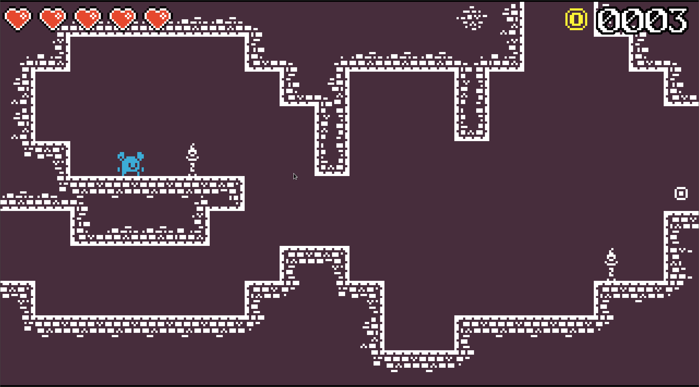

Abyssians
=========

**In development!**

Abyssians to gra będąca mixem gatunków **RougeLite** i **Metroidvanii**. Jest to opowieść o samotnym wojowniku w zniszczonym i 
rozpadającym się świecie, gdzie ostatnie ślady dawnej cywilizacji terroryzują jej obecnych mieszkańców.

Gra została stworzona prz użyciu silnika [Godot](https://godotengine.org).

[**Scenariusze testowe**](test-scenarios.md)

Wspierane platformy
-------------------

Platformy które zamierzamy wspierać:

* Linux
* Windows

Diagramy UML
------------


Ekrany aplikacji
----------------

Główne menu:



Ustawienia:



Gameplay:







Przykładowa funkcjonalność
--------------------------

```gdscript
# Checks if player collided with enemy
func _on_Area2D_body_entered(body : Node):
	if !wasHit and !knockedOut and !invincible:
		if (position - body.position).normalized().x > 0:
			direction = Vector2(1, -1)
			motion = direction * MAX_SPEED / 2
		else:
			direction = Vector2(-1, -1)
			motion = direction * MAX_SPEED / 2
		lifes -= 1
		set_deferred("wasHit", true)
		emit_signal("hearts_update", lifes)
```

Podsumowanie
------------

Gra jest na etapie na którym można by już zaczynać projektować poziomy, przeciwników, itp.  
Pojawiło się trochę bugów (lekko ruszające się elementy interfejsu, niepoprawnie działający system odrzutu po otrzymaniu obrażeń, itd.), jednak żaden z nich nie sprawia, że gra jest niegrywalna.

W grze napewno brakuje zmiany poziomu, zapisu gry, więcej przeciwników i kilka pomniejszych mechanik(znajdźki, koniec poziomu, itp.).

Autorzy
-------
* Kuba Woroh [(kubek344)](https://github.com/kubek344)
* Maciej Tułecki [(OortCloud42)](https://github.com/OortCloud42)
* Piotr Zieniewicz [(akinhet)](https://github.com/akinhet)


- [x] cat
